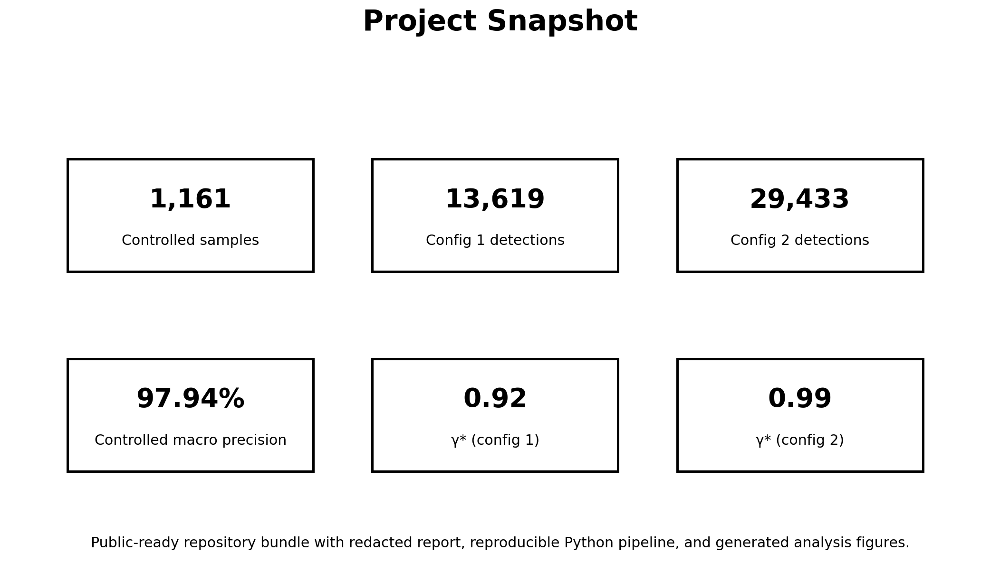
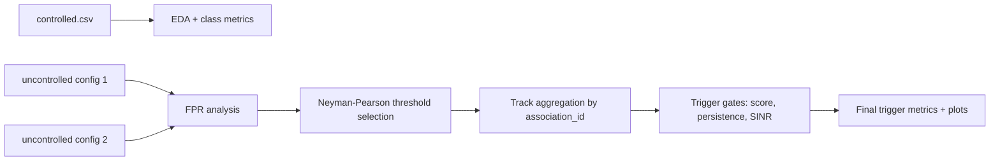

<div align="center">

# Spectral Detection Data Analysis

**Public GitHub-ready repository for controlled and uncontrolled RF spectral detection analysis**



</div>

## Why this repository is useful

This project packages an end-to-end analysis workflow for RF spectral detections:
- **Controlled evaluation** for precision and recall inspection
- **Uncontrolled evaluation** for noise robustness and false positive behavior
- **Track-level trigger design** using a Neyman–Pearson threshold and reliability gates
- **Public-safe documentation** with a redacted PDF report

## Visual overview



## Repository structure

```text
spectral-detection-analysis/
├── analysis.py
├── requirements.txt
├── .gitignore
├── data/
│   ├── controlled.csv
│   ├── uncontrolled_detections_export_config_1.csv
│   └── uncontrolled_detections_export_config_2.csv
├── assets/
│   └── figures/
│       ├── overview_dashboard.png
│       ├── controlled_score_histogram.png
│       ├── noise_fpr_curves.png
│       ├── category_mix.png
│       └── trigger_tradeoff.png
└── report/
    └── spectral_detection_data_analysis_report_redacted.pdf
```

## Dataset snapshot

| Dataset | Rows | Notes |
|---|---:|---|
| Controlled | 1,161 | Labeled set for precision/recall inspection |
| Uncontrolled – config 1 | 13,619 | Lower false alarm setting than config 2 |
| Uncontrolled – config 2 | 29,433 | Harder setting with more noise-driven alerts |

## Key findings

| Finding | Result |
|---|---|
| Controlled macro precision at `γ = 0.90` | **97.9%** |
| Controlled macro recall at `γ = 0.90` | **82.0%** |
| Neyman–Pearson threshold for config 1 | **γ* = 0.92** |
| Neyman–Pearson threshold for config 2 | **γ* = 0.99** |
| Config 1 track FPR improvement | **0.060 → 0.046** |
| Config 2 track FPR improvement | **0.110 → 0.045** |

## Plot gallery

<p align="center">
  
  
</p>

<p align="center">
  
  
</p>

## Trigger comparison

| Configuration | Baseline FPR | Final FPR | Baseline relative recall | Final relative recall |
|---|---:|---:|---:|---:|
| Config 1 | 0.060 | 0.046 | 0.601 | 0.555 |
| Config 2 | 0.110 | 0.045 | 0.288 | 0.082 |

## Quick start

### 1) Create an environment

```bash
python -m venv .venv
source .venv/bin/activate  # Windows: .venv\Scripts\activate
pip install -r requirements.txt
```

### 2) Run the analysis

```bash
python analysis.py
```

### 3) Run headless and save plots

```bash
python analysis.py --no-show --save-plots-dir outputs/plots
```

## What the code does

- Reads the three CSV datasets from `data/`
- Generates score, FPR, and parameter-based diagnostic plots
- Computes controlled precision/recall summaries
- Estimates noise-only false positive rate curves
- Builds track-level summaries using `association_id`
- Applies a trigger with score, persistence, and signal-quality gates

## Included report

The repository includes a public-shareable report version:

- `report/spectral_detection_data_analysis_report_redacted.pdf`

## Suggested GitHub repo description

> RF spectral detection analysis with controlled/uncontrolled evaluation, Neyman–Pearson trigger design, and visual diagnostics.

## License / usage note

This package was prepared as a **portfolio-style public repository**. Review the data-sharing policy before publishing the raw CSV files publicly.
